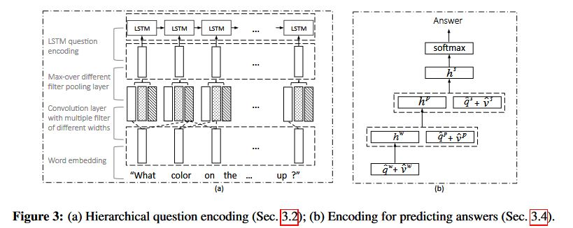

# Hierarchical Question-Imagee Co-Attention for Visual Question Answering

This is MXNet implementation of Hierarchical Question-Image Co-Attention for Visual Question Answering(https://arxiv.org/abs/1606.00061)

#### Train
`python train.py --cfg cfgs/hierarchical.yaml`

##### Reference
[1][HieCoAttenVQA](https://github.com/jiasenlu/HieCoAttenVQA)

[2][vqa-sva](https://github.com/shtechair/vqa-sva)
